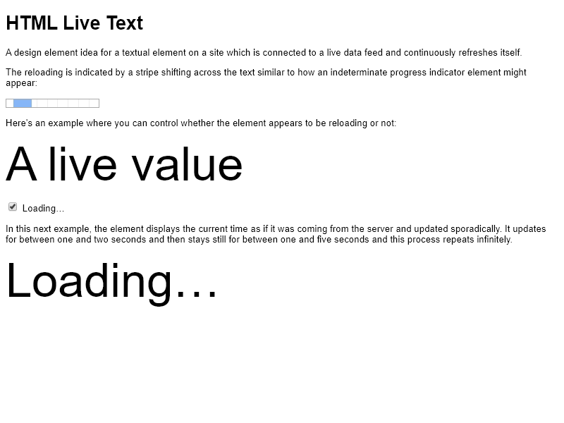

# HTML Live Text

[**LIVE**](https://tomashubelbauer.github.io/html-live-text)

A prototype of a design element of a connected text element which indicates it
is reloading by having a stripe shift across it similarly to indeterminate
progress indicator.

<!-- Generated using cmd/screencast -->

## To-Do

### Fix the broken animation on the time element

It is not smooth like the one above it which probably has to do with class
assignment.
